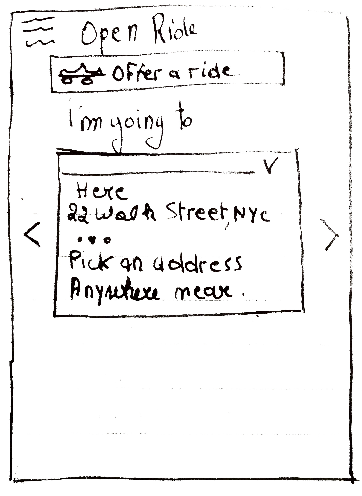
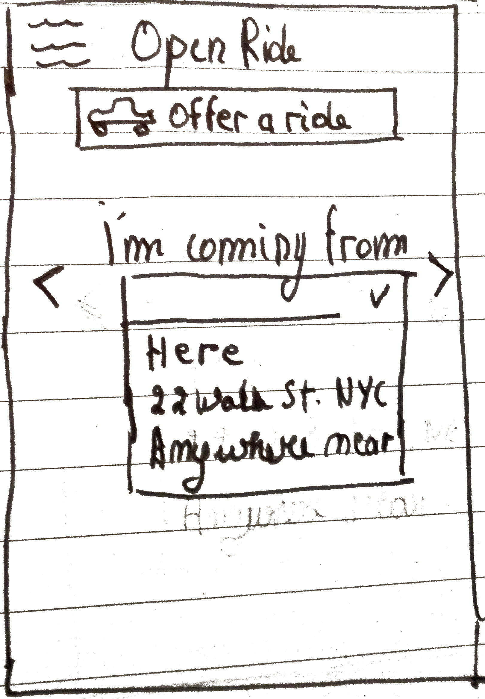
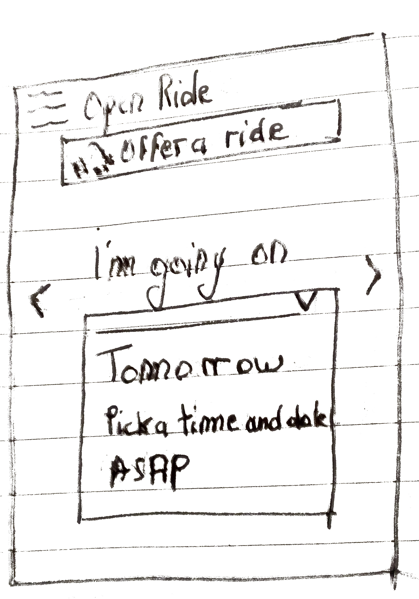

# Openride

Openride ("hop'n'ride") is a FOSS and decentralized carsharing plateform. It is designed to support free, shared-cost and commercial transportation (with a focus on user-awareness), on a planned and real-time basis. 

## Motivation

### History

Transportation is a crucial aspect of human activity. Since dark age, locomotion is one of the main characteristics of life 
(especially in the animal reign). Since [at least 9000 years](https://en.wikipedia.org/wiki/Vehicle#History), humans used 
some sort of tool to move themself to any distant location, using a large variety of vehicles, running on wheels or legs, motorized or 
biologic, across the sea, along the road and in the air. This allowed us to trade, conquer, exchange and communicate. This allowed us to grow.

Among these diverse vehicles, one of them found its way to the public after the second world war in Europe, to the point it is now
the main source of locomotion for a large proportion of the general population. Cheap gaz and steel, large-scale production lines, new ways 
of manufacturing, allow the middle class to own a car and to migrate from city centers to suburbs. This phenomenon had an influence on global
economy and human occupation of space - until today, cities are designed mostly for being used by cars.

But things have changed a lot for the few last decades. Oil is getting rarer and cheaper since [1973](https://en.wikipedia.org/wiki/1973_oil_crisis),
consequences of atmospheric pollution are getting better-known, and global warming is pushing politics accross the globe toward more ecological 
policies. That being said, cars will probably still be used in the future. Thanks to technological advancement, they are consuming less and less oil,
and a lot of researches are made about alternative energy source for individual locomotion. In addition, thanks to advancement in the IA field,
in a near future, cars are likely not to need any human supervision.

But the ecological aspect of automobiles isn't the only issue. Individual vehicles are also a problem in term of city planning.
In big clusters of human habitation, physical space is lacking for every cars to go to a certain area, especially during commuting time. It is
one the biggest challenge of nowadays urbanists - how to avoid traffic jam. We could indeed  see a spectacular development of 
new practice designed to optimize the use of a given vehicle, like carsharing. 

The first decade of this new millenium saw the emergence of the so-called "sharing economy", bought by the generalisation of internet 
access and mobile phones. Among these new players, Uber is a well-known taxi-like plateform supposed to be compete with traditional, protectionist
taxi company. While Uber is designed to enable real-time, short urban transportation, some other plateform are made for inter-city rides, such as 
[Zimride](https://www.zimride.com) in the US, [Amigo Express](https://www.amigoexpress.com/) in Quebec or Blablacar in Europe. In a context in which public transportation
such as trains or buses are not as developped or expensive, carsharing can provide a cheap and effective way to travel.

### Ethical aspect

Of course, carsharing and taxis always existed. Hitchiking is a free, imprevisible but adventurous way to travel, while plain-old carpooling have been sanctionned
by authorities since world war too. However, the use of information technology enabled more effisciency in the use of these technics. But new technics bring new 
chalenges, and "sharing economy" isn't an exception. (Critics have been formulated)[https://en.wikipedia.org/wiki/Uber_(company)#Criticism] 
against these start-ups, in terms of work condition, security and ethics. 

What was designed to be a convivial, private deal soon became a job, and then an industry. 
Monetarization of these practices have been rampant since their launching. For example, some carsharing driver have the temptation to 
drive their society car to make some extra-money, which is not in the original spirit of the practice. In addition, sharing economy company
are taking an unfair proportion of every ride or gigs, not related to their fixed fees for server maintenance and evolution. 
In an attempt not to follows this trends, our plateform is designed to bring back openness and ethic in this market. Here are a few characteristics
that are desirable in such a system : 

* **Free software**: clients and server of such systems are free and open-source. Every piece of software is released under the 
(GNU General Public License 2.0)[https://opensource.org/licenses/GPL-2.0].
Payments, maps and other dependancies are, as much as possible, based on free technologies 
such as (bitcoin)[https://www.bitcoin.com/] and (OsmAnd)[http://osmand.net/]. 
To be accessible for inexperienced user, commercial alternative such as Google Maps 
or Paypal would also be usable on the Plateform. 

* **Decentralised**: servers would be able to exchange informations about rides and to fix their fees policy. 
That way, nobody is solely responsible for the maintenance of the network. Generally speaking, the 
system would encourage the clear and open explanations of any fees.

* **Transparent and convivial**: The network would be usable in three distincts remuneration mode. 
First, the system would encourage *free and convivial*, digital "hitch-hiking"-style rides. For those 
who want to split the gaz bill, a *compensation* mode would also be available. That is the way Blablacar 
and such are supposed to work - each passagers (driver included) is paying his part of the tolls and gaz 
expenses. Thirdly, the system would allows a commercial mode, especially in "real-time", taxi-like mode.
However, this way of using the plateform would be clearly indicated, and earnings openly showed on each profile.

* **Secured**: each profile would have to be rated after each interaction. Poor rating would trigger a warning, and rating
are mandatory after each rides. 

* **Easy**: however one decide to use it, the average user have to find or publish his wish in the first two minuts after the installation of the app. Indeed, the usability and generability (the fact that it can be used by a large set of users for different purposes) will be the main factor to reach the critical mass of user.

In addition, let's specify that the apps would be usable in a immediate, intra-city and locale 
manner as much as in a planned, inter-city one. 

## Technological stack

As much as possible, the app would use Free and Open Source softwares and open services. It would use the following stack. For the backend, we will use

* (Node.js)[https://nodejs.org/en/] for the server environment
* (Restify)[http://restify.com/] to serve the RESTful API.
* (CouchDB)[http://couchdb.apache.org/] as a database

For the frontend, we will use the (Ionic)[https://ionicframework.com/] framework, based on 
Angular and PhoneGap. The app will prioritize the use of FOSS alternative as 
service provider - namely, (bitcoin)[https://www.bitcoin.com/] and (OsmAnd)[http://osmand.net/]. That being said, for the sake of mainstream penetration, use of some more traditional technologies, like
Google Maps or PayPal, can also be used. For payement, cash is also supposed to be designed. 

*Note*: the (Kill Bill)[http://killbill.io/payments-platform/] payement plateform could be used. 

## User eXperience aspect

The very diverse practices of carsharing have, in history, taken three main shape, caracterised 
on three dimensions. People seeks passenger for two reasons: the social and economical adventage 
they could find. People ride because they don't own a car, for physical (impaired, elderies), 
economical (precarious, students), legal (no driving licence) or political reasons 
(urban population,...) These three ways of caracterising every carshared trips are the following: 

* **How far** is the trip going? We will distinct intra-city, **locale** transportation often taken for 
commuting or family purposes, and inter-city, **long distance** transportation. The former is of 
course way cheaper than the later, but subject to more extreme variation of supply and demand: 
during the night, the offer usually drop dramatically, while it's at its peak at rush hour.

* *When* will the trip take place? Some model are designed for the user to state his trip in 
**real-time** and to go as soon as possible, while some other (**planned**) will require the 
user to plan and prepare his trip a few days or weeks in advance. 

* *How much* will the trip cost? Some driver could just drive passengers for **free** and simply 
seek company, while someother will ask the passengers to **share** the cost. Finally, some drivers 
will try to withdraw **pecuniary** advantages, sometime to the point it become their main 
professional activity. 

Three main models of shared transportation have been established thorough history: 

* The car-to-hire model is traditionnaly known as the taxi/cab services across the globe. It's the model follow by new players like [Uber](https://www.uber.com/) or [LibreTaxi](http://libretaxi.org/). 
* Traditional carsharing like [BlaBlacar](https://www.blablacar.be/) or [AmigoExpress](https://www.amigoexpress.com/).  
* [Hitchiking](https://en.wikipedia.org/wiki/Hitchhiking), a free, yet unprevisible way to travel

| Model        | Distance      | Time        | Cost      |
|--------------|---------------|-------------|-----------|
| Car-to-hire  | Locale        | Real time   | Pecuniary |
| Carsharing   | Long-distance | Planned     | Shared    |
| Hitch-hiking | Long-distance | Real time   | Free      |

### Lexical analysis

- A *ride* is a journey made by a *vehicle* from a *origin* to a *destination*, with a *driver* and a certain amount
of *passenger* on board, at a specific *time*. It often imply a *payement* from the passenger to the driver. 
A ride destination and/or origin can be set to a zone or region and doesn't need to be a specific address.
	* At any moment, the user can *request* or *offer* a ride from an origin to his.er destination. 
	S.he can set the ride *destination* and *origin*, the *time* (and date, it can be set as *ASAP*) of the ride and the *payement* he want to offer or recieve. 
	S.he will then be match with corresponding ride propositions. 
	If none is available or satisfying for him.her, the system will send a push notification when another ride is available.
	One a ride is accepted by the user, it is set as *opened*.
	At the beginning of the ride, the system will send a push notification to the user to link to any navigation system.
	After the ride, it is considered as *closed*, the system will send a feedback request to give *feedbacks* to the users. 
	* Rides can also be edited or closed at all time - sending a push notification to any concerned users.

- An *user* is the person using the service. S.he is followed by a certain ammount of positive or negative *feedbacks*
	* S.he can have access to his.er own vehicle and thus looking 
	for co-riders, for company, cost-sharing or strictly for money. S.he will then be a driver. 
	* S.he can also have no access to any vehicle and thus seek a cheap 
	ride for convenience. S.he will be a *rider*. The driver will pick him.her up
	at a specific *pickup point*.
- A *vehicle* is a car used for *car sharing*. He have a specific capacity 
(in term of passengers) and a specific gaz consumption.
- A *payement* is a exchange of money between two pairs. 
In this specific field, the money will be given by the riders to
the driver in cash, cryptocurrency or internet credit-card based payement service. 

### Personae

* **Stephen, the backpacker**

In the aftermath of global internet connection during the 2000 decade, a grassroot movement of diverse
crowd started rediscovering a new way to travel. Based on the old hippie travel practice and its
infrastructure (youth hostel, bus, hitch-hiking) and fueled by low-cost flight across the globe,
the typical backpacker use websites like couchsurfing or BeWelcome, Workaway or Whoofing for 
accomodation. These crowd are usually minimalist and looking for cheap trips. They aren't poor though,
and will often be ready to pay the fair price if needed, especially if it respect some ethical
standards. They are often in needs of long-distance travel and are prone to flexible, short term 
decision. He's super connected and prone to use new electronic means of payement and transportation.

* **Juliana, the student**

In big international university cities, public transportation is traditionally the more convenient
way for intra-city transportation. That being said, with the developpement of austerity policies, 
lack of public investment and the trends toward privatization, it is likely that public 
transportation systems will gets more and more expensive and maybe not always reliable. 
As a matter of fact, as a young adult, Juliana is sensibilised to impaired driving problematic, 
and always leave her vehicle behind when she goes party downtown. She often stay in town after 
bus hours, and is willing to use Uber or a taxi to come back home. She often pays cash. 
During the week-end, she can use her parent second car, especially for short city trips. 

* **Jocelyne, the single mother**

In urban environment, the desagregation of traditional nuclear family have underlied the apparition
of a precarious, mostly feminine and often racialized population. This population often have to 
own a personal vehicle despite a low- to middle-paying job. Their transportation needs are mostly
short-distance and can be fulfilled by the bus systen, but they sometime have to quit the city for 
family visit or short vacation. In this situation, they often have to bring a few passagers with them. 
She have a credit card and is willing to provide for her family. She is susceptible to use her car to
provide service and make some extra-money.

* **Claudio, the retiree**

A lot of retiree start to suffer from limitation in their hability to drive. They are often seeking 
a place in which they can access groceries store and facilities nearby. Moreover, retirement often 
means a diminution of the accessible net income, discouraging the daily use of a personal 
vehicle. That being said, retiree often go on long-distant trips to their holiday 
location. In this situation, even through their are often not computer-savyy, they could seek
the company and saving linked with finding some passenger. 

* **Louis, the sales representative**

A lot of people have to adopt a nomadic way of life to sustain their professional career. For example, 
a sales represenative often have to take some week-long road trip accross the country to exert their
job. This persona would thus tends to seek some company - sharing the cost of the ride have no meaning
since they usually enjoy a company-paid car. 

### User cases

* **User case 0: logging on**

- Scope: mobile application
- Level: +
- Basic flow:

The user install the application and have to log on, whether it is using her SNS account like F*cebook or Go0gle, 
or with a pair of username / password. S.he is directly redirected to a screen allowing her to add a ride (NB: will it
be clear enough that one can whether propose or request a ride with the same option?). S.he will also see the open rides s.he
already proposed or reserved (open or closed). 

* **User case A: requesting a ride to the next city**

- Scope: mobile application
- Level: -
- Primary actor: Juliana, Louis

- Basic flow:

    Juliana have to come back home from her campus for the week-end. Trains are expensive, and she saw about
    Openride on a poster in the campus. She will connect for the first time (UC0), then add a drive request 
    from the main menu. She will indicate her destination, then set her origin as her current location. 
    She will set the time to friday afternoon, 5pm.
    The system will indicate that no ride match her destination yet. 

    After a few hour, she will recieve a push notification stating that a ride have been added that 
    could interest her. Indeed, it would allow her to be home at 8pm, the person being planning to 
    start from a place within a busride range from her dorm. She also learn that the ride would cost her
    25$, which is the average for this kind of ride. She checks the driver's feedback and feels reassured.
    She pushes on "accept", pays (see User case F - setting up payment) and is redirected to her ride menu,
    which status is now set on "open". She can then access the ride menu anytime from the main screen, 
    under the "opened ride" section. 

    At the time of the ride, she will recieve a push notification asking if she arrived at the meeting point yet. 
    She actually was already in the car thanks to the phone number of the driver she got in the app. 
    After a wonderful ride, she leaves a feedback about the driver. She wasn't expecting things 
    to go that smoothly!

* **User case A2: offering a ride to the next city**

- Scope: mobile application
- Level: -
- Primary actor: Louis, Juliana

    Louis recieve a call from his boss with his next assignement. He will have to go on friday 
    from his remote city to a big college town. 
    Spending a lot of time alone on the road, he's in need for company. 
    He will open the app (that is already connected to his account)
    and add a trip as a driver. He will indicate the destination, origin, departure time 
    (on Friday 8PM) and how much he want to get paid. 
    He have the option of setting some waypoint to pick up other passenger, 
    but since he want to go quick, he chosed not to. 

    He directly sees that a girl named Juliana, whose status indicate 
    she's a student, is looking for a ride starting nearby his place. 
    He directly state that he's interested in her profile, and is redirected to the main 
    ride menu. He could chat directly with the users in a group chat room, but chose 
    to leave a message asking to be called directly on his phone. 

    At the time of the ride, he meets Juliana at the pick-up point. She actually gave him
    a call to check the exact location and car. At 8PM, they are ready to go, and the app 
    redirect him to Go*gle Maps to show him his itinerary. 

    After the trip, during which he had a pleasant time,  
    he leaves a feedback on Juliana's profile to recommands her to other users. 

* **User case B: driving to distant city**

- Scope: mobile application
- Level: -
- Primary actor: Louis
- Similar as: A2 - offer a ride to the next city

    This time, Louis have to ride through the country for his holiday. That will probably take
    him the whole day, and he doesn't want to do it alone. He then proceed as usual, except on one point.
    During the ride adding process (see user case A2 - offering a ride to the next city), 
    he indicate four cities in which he will stop. The system proposed him the corresponding 
    pick-up point and ETAs, which he left as is. 

* **User case C: coming back home after a party**

- Scope: mobile application
- Level: 0
- Primary actor: Juliana, Jocelyne
- Time: during the night

    Jocelyne went to a club with her friends in the other side of town. Being responsible,
    she didn't took her car, but time flew and now she have to spend two hour in night busses. 

    She checks the OpenRide application, and see that somebody near her is willing to take her
    back home. She's creating a ride from her location to her dorm, and set
    the time as "As soon as possible". She then sees that somebody hearby is willing to 
    drive her home. Checking the profile, she sees a single mother looking for some
    extra-money. She then click on "Interested", and after a few minutes, the person
    accepts the ride. 

    The rest will happen exactly as described in User case A1 - requesting a ride to the next
    city.

* **User case D: finding a ride as soon as possible**
* **User case E: setting up payement**
* **User case F: configuring the app**

### Sketches

## API proposal
## Schedule

| Milestone                      | Deadline             | Status   |
|--------------------------------|----------------------|----------|
| Whitepaper	                 | November 2017        | Finished |
| UX design                      | Mid-november 2017    | Finished |
| Front-end skeleton             | Mid-december 2017    | Pending  |
| Basic backend                  | January 2018         |          |
| Geolocalisation                | February 2018        |          |
| Payment system                 | March 2018           |          |
| Real time ride                 | April 2018           |          |
| Notification                   |                      |          |
| Emails                         |                      |          |
| Fee system,                    | May 2018             |          |
| Internationalisation           |                      |          |
| Decentralisation               |                      |          |
| Website                        | June 2018            |          |

## Further development

One could work on a social media system to let user propose or request a ride to his.her friends or collegues. 
